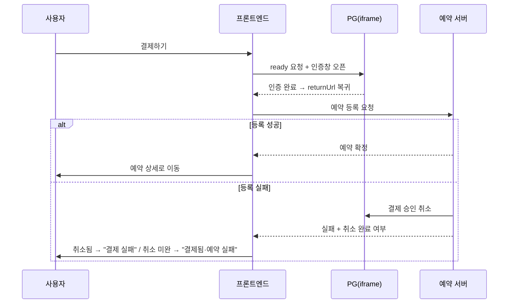

> 관련 프로젝트: [멀티테넌트 예약 SaaS](/projects/multitenant-booking-saas)

## 배경

멀티테넌트 예약 SaaS에서 숙박·레저·티켓의 예약 / 결제 / 취소 전체 플로우를 프론트엔드에서 단독으로 개발했다. 결제는 PG(KICC EasyPay)를 iframe 인증 방식으로 연동했고, 흐름은 **결제 인증 → 복귀 → 예약 등록(확정)** 순서로 이어진다.

문제는 이 구조가 본질적으로 **"결제 성공"과 "예약 완료"를 분리**한다는 점이다.

> **정정 (2026-08-18)**
> 처음 발행할 때 "프론트엔드가 결제를 자동 취소한다"고 썼는데, 코드를 다시 확인해 보니 정확하지 않았다.
> 승인 취소는 서버가 수행하고(`실패 시 backend 가 PG 취소 시도`), 프론트엔드는 그 결과를 판별해 사용자에게
> 다른 문구로 안내하는 역할이다. 본문과 시퀀스 다이어그램의 주체를 바로잡았다.

## 문제 1: 결제 성공 ≠ 예약 완료

PG 승인(결제)과 예약 등록(우리 서버)이 별도 단계라, **PG 승인은 났는데 등록이 실패하면 "돈은 나갔는데 예약은 없는" 상태**가 생긴다. 금융 플로우에서 가장 치명적인 불일치다.

해결은 순서를 뒤집는 게 아니라, **등록 성공이 확정될 때까지 결제를 '확정'으로 취급하지 않는 것**이었다.

등록이 실패하면 **서버가 PG 승인을 취소한다.** 프론트엔드 몫은 그 응답에서 취소가 실제로 끝났는지까지 판별해, "결제 실패"와 "결제는 됐지만 예약이 실패한 상태"를 **다르게 안내하는 것**이다.

이 둘을 한 문구로 뭉치면 이미 돈이 빠져나간 사용자가 결제를 한 번 더 시도한다. 그래서 화면에 띄울 문구가 두 개여야 했고, 그 판단 근거를 응답에서 뽑아내는 게 프론트의 일이었다.

## 문제 2: 복귀 시점의 레이스 컨디션

복귀 핸들러(iframe)가 등록 성공 후 상세 페이지 링크를 만들 때 게스트 세션을 읽는데, 부모의 결과 핸들러가 그 값을 **쓰는 시점이 iframe이 읽는 시점보다 늦어** 세션이 비는 레이스가 있었다. 특히 레저 결제는 cross-origin 라운드트립이라 sessionStorage 자체가 비기도 했다.

해결:

- 게스트 세션을 **결제 시작 시점에 미리 저장**해, 복귀 시 read가 항상 값을 얻도록 순서를 보장.
- 보조로 상품 유형(숙박/레저)을 쿠키에 기록해, sessionStorage가 비어도 등록 엔드포인트 선택이 견디도록 폴백을 뒀다.

## 문제 3: 정상 응답을 실패로 오판

레저 PG는 정상일 때 `status: "PAYMENT_READY"`, `resultCode: "0000"`을 내려준다. 그런데 `PAYMENT_READY`를 실패로 처리하면 `resultMessage`("정상")가 에러로 떠서 인증 iframe이 열리지 않았다.

PG 문서만 믿지 않고 실제 응답을 로그로 확인해, 성공 판정을 **`status ∈ {SUCCESS, OK, PAYMENT_READY, READY}` 그리고 `resultCode ∈ {0000, 0}`** 조합으로 정확히 정의했다.

## 보안 설계

- 예약 식별정보를 **AES-256-GCM 봉인 토큰**으로 인계 (TTL 10분). URL 쿼리에 식별정보가 그대로 실리던 것을 제거했다.
- BFF 프록시로 PG·API 키를 서버사이드에 은닉.

## 배운 점

- 결제는 "성공/실패"가 아니라 **"돈과 서비스가 일치하는가"**의 문제다. 단계가 나뉘는 순간 불일치 가능성이 생기고, 그건 **서버의 보상 취소 + 프론트의 상태 구분 안내**가 맞물려야 닫힌다. 어느 한쪽만으로는 사용자가 재결제하는 경로가 남는다.
- **PG 연동은 문서보다 실제 응답이 진실이다.** status/resultCode 조합은 실측으로 확정했다.
- 복귀·cross-origin처럼 타이밍이 얽히는 곳은 "쓰기를 읽기보다 앞당기고, 폴백을 둔다"가 안전하다.
