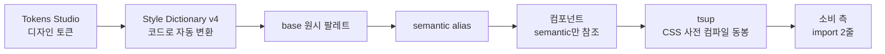

> 관련 프로젝트: [사내 디자인 시스템](/projects/design-system)

## 배경

사내 OMS 디자인 시스템(`@h2o/design-system`)을 빈 레포에서 구축하면서 디자인 토큰·컴포넌트·번들 파이프라인을 담당했다. 디자인 시스템은 여러 서비스가 가져다 쓰는 기반이라, 컴포넌트가 늘수록 번들 크기가 소비 측 성능에 직접 영향을 준다. 그래서 PR마다 번들 증가분을 막는 **size-limit CI 게이트**를 세워 두고 있었다.

## 문제: 게이트가 움직이지 않았다

어느 날 컴포넌트를 여러 개 추가했는데, size-limit 게이트 수치가 거의 변하지 않았다. 감각적으로 이상해서 실제 배포 번들을 직접 재봤더니, 게이트가 보고하는 값과 실제 크기가 크게 달랐다.

원인을 파고들어 보니, size-limit 설정이 각 컴포넌트의 **진입점 파일(index)만** 측정하고 있었다. 실제로 소비 측에서 import했을 때 함께 번들되는 의존성·CSS·트리셰이킹 이후의 코드는 반영되지 않았다. **진입점만 재느라 실제 번들 크기를 온전히 반영하지 못하고 있었던 것**이다.

| | 게이트가 재던 것 | 실제 소비자가 받는 것 |
|---|---|---|
| 측정 대상 | 진입점 파일 단독 | 의존성·CSS·트리셰이킹 결과 포함 |
| 크기 | 실제보다 훨씬 작게 측정 | 100% |
| 결과 | 증가분을 못 잡음 | — |

즉, 게이트가 사실상 무의미했다. 더 큰 문제는, 이전에 팀에 "번들이 이 정도"라고 **공유된 수치가 실제와 무관**했다는 점이었다. 잘못된 지표를 기준으로 판단이 이뤄지고 있었다.

## 접근: 무엇을 '재야' 하는가부터

숫자를 고치기 전에 기준부터 다시 잡았다. 재야 하는 건 "진입점 파일 크기"가 아니라 **소비 측이 import했을 때 최종적으로 번들되는 형태**(트리셰이킹·CSS 포함, 압축 후) 크기다.

- size-limit의 `preset-small-lib`로 측정 방식을 교체 — 실제 번들링을 시뮬레이션하고 **brotli 압축 기준**으로 계산.
- 게이트 8개를 컴포넌트별 실측 기준으로 재설계. Button / Input / Dropdown / Badge 등을 **brotli 압축 기준으로 번들 크기 가드**를 설정.
- 이전에 공유된 수치가 실제와 무관함을 **MR에 정정 기록** — 팀이 잘못된 기준을 그대로 믿지 않도록.

## 결과

- 게이트가 실제 번들 증가를 잡는 도구로 복구됐다.
- 잘못된 기준치를 정정해, 팀의 의사결정 기반을 교정했다.

## 함께 세운 토큰 파이프라인

같은 시기에 토큰·컴포넌트 파이프라인도 구축했다.

- **2계층 토큰**: `base` 원시 팔레트 + `semantic` alias. 컴포넌트는 semantic만 참조해 하드코딩 값을 줄였다.
- **패키지화**: tsup으로 CSS를 사전 컴파일해 동봉 → 소비 측은 import 2줄로 사용.
- **다크모드**: Figma 매핑으로 라이트/다크 토큰 대응.
- 컴포넌트 8종(오버레이 3종 포함) `0.2.5` 배포.

## 배운 점

- **CI 게이트는 "숫자가 보인다"와 "맞는 숫자다"가 다르다.** 도구가 무엇을 재는지 스스로 검증하지 않으면, 게이트가 켜져 있어도 아무것도 지키지 못한다.
- **잘못된 지표는 없는 지표보다 위험하다.** 팀이 그 숫자를 믿고 판단하기 때문이다. 그래서 발견 즉시 정정 기록을 남기는 것까지가 수정이었다.

> 이 경험 이후로, 새 도구를 붙일 때 "이게 정확히 무엇을 측정/보장하는가"를 먼저 실측으로 확인하는 습관이 생겼다.
